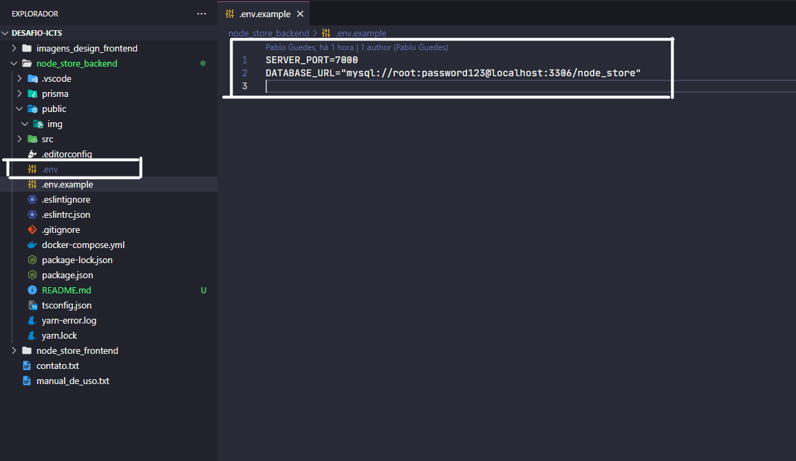

## NodeStore 
  Sistema de compra de produtos desenvolvido em ReactJS e TypeScript

### Telas

Home 


Cadastro e listagem de produtos


Compra e listagem de compras


Detalhes de produto 


Detalhes de compra 


Edição de produto


Edição de compra


### Requisitos para utilização do sistema
  - Node
  - Docker 
  - MySQL

### 1. Instalar as depedências.
  ```npm install```
	ou
  ```yarn```

### 2. Rodar a imagem do docker para iniciar o banco de dados:
  ```docker-compose up -d```

### 3. Criar um arquivo ".env" na raiz do projeto




### 4. Copiar os conteúdo do arquivo ".env.example" localizado na raiz do projeto e
   colar no arquivo ".env" criado na etapa anterior.

### 5. Rodar o comando abaixo para realizar as migrações para o banco de dados que
   foi criado na etapa "2".
  ```npx prisma migrate dev```
	ou
  ```yarn prisma migrate dev```

### 6. Rodar o sistema
  ```npm start```
	ou
  ```yarn start```
